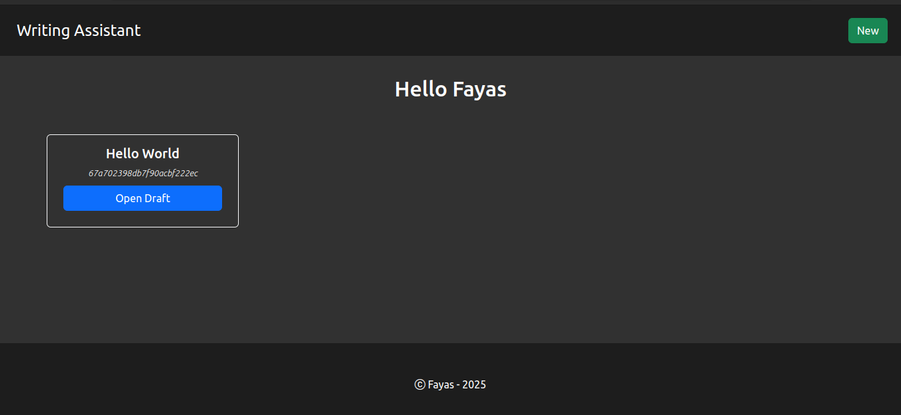
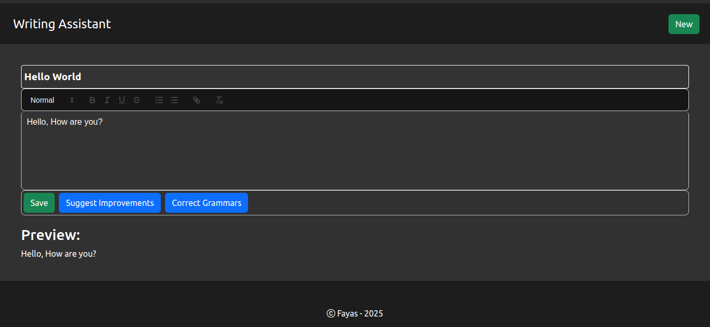
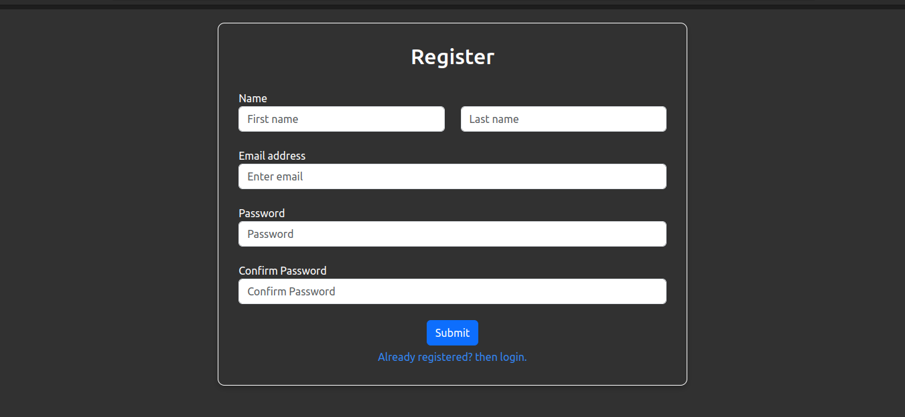
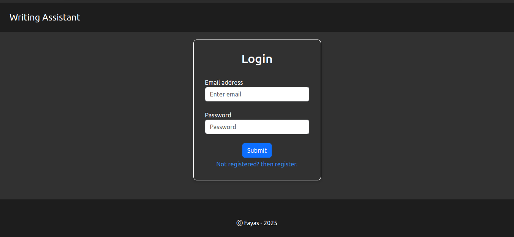

# Writing Assistant

An AI-powered writing assistant website built with a ReactJS frontend and a backend powered by ExpressJS and Python FastAPI.

---

## Features

- **Grammar Checking**: Corrects grammar mistakes in your text.
- **Improvement Suggestions**: Provides suggestions to improve your text.

---

## Used Technologies

- **Frontend**: ReactJS
- **Backend**: ExpressJS, Python FastAPI
- **AI Model**: Gemini Pro
- **Database**: MongoDB
- **Authentication**: JWT

---

## How to run?

> **Note**: Ensure you add your API keys and required environment variables in the `.env` file as shown in the `.env.example` file.

---

#### Run express.js backend

1. Go to the `backend` directory.
   ```bash
   cd backend
   ```
2. Install the required dependencies:
   ```bash
   npm install
   ```
3. Run the following command:
   ```bash
   npm run dev
   ```
4. The backend server will start running on `http://localhost:5000`.

#### Run python-backend

1. Go to the `python-backend` directory.
   ```bash
   cd backend
   ```
2. Create a virtual environment:
   ```bash
   python3 -m venv .venv
   ```
3. Activate the virtual environment:
   > linux command
   ```bash
   . ./.venv/bin/activate
   ```
4. Install the required dependencies:
   ```bash
   pip install -r requirements.txt
   ```
5. Run the following command:
   ```bash
   fastapi run
   ```
6. The backend server will start running on `http://localhost:8000`.

#### Run frontend

1. Go to the `frontend` directory.
   ```bash
   cd frontend
   ```
2. Install the required dependencies:
   ```bash
   npm install
   ```
3. Run the following command:
   ```bash
   npm run dev
   ```
4. The frontend server will start running on `http://localhost:5173`.

---

## Screenshots






---
